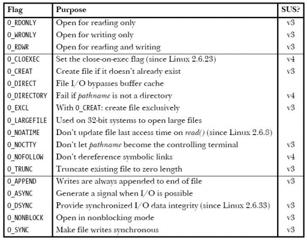

# Week 3

## Stat system call
System call that returns information of a file such as permissions, size, last modified which is returned as a struct in C named stat

```
struct stat {
    dev_t st_dev; /* ID of device containing file */
    ino_t st_ino; /* inode number */
    mode_t st_mode; /* file type and permissions */
    nlink_t st_nlink; /* number of hard links */
    uid_t st_uid; /* user ID of owner */
    gid_t st_gid; /* group ID of owner */
    dev_t st_rdev; /* device ID (if special file) */
    off_t st_size; /* total size, in bytes */
    blksize_t st_blksize; /* blocksize for file system I/O */
    blkcnt_t st_blocks; /* number of 512B blocks allocated */
    time_t st_atime; /* time of last access */
    time_t st_mtime; /* time of last modification */
    time_t st_ctime; /* time of last status change */
};
```

### st_mode macros

```
S_ISREG(m) is it a regular file?
S_ISDIR(m) directory?
S_ISCHR(m) character device? : device driver communicates by sending and receiving
single characters (bytes, octets).
S_ISBLK(m) block device? : device driver communicates by sending entire blocks of data.
S_ISFIFO(m) FIFO (named pipe)?
S_ISLNK(m) symbolic link? (Not in POSIX.1-1996.)
S_ISSOCK(m) socket?(Not in POSIX.1-1996.)
```

### st _mode flags
```
#define S_IRUSR __S_IREAD /* Read by owner. */
#define S_IWUSR __S_IWRITE /* Write by owner. */
#define S_IXUSR __S_IEXEC /* Execute by owner. */
…
#define S_IRGRP (S_IRUSR >> 3) /* Read by group. */
```

## Key system calls
open(): open & possibly create file/device

read(): read from file descriptor

write(): writes up to `count` bytes from the buffer pointed `buf` to the file referred by `fd`

close(): closes file descriptor so that it doesn't refer to any file & can be reused

### open() flags



### open() errors
- EACCES
- EISDIR
- EMFILE
- ENFILE
- ENOENT – file does not exist and O_CREAT not specified
- EROFS – file system read only
- ETXTBSY – executable that is currently running

### lseek
reposition read/write file offset

SEEK_SET - The offset is set to offset bytes.

SEEK_CUR - The offset is set to its current location plus offset bytes.

SEEK_END - The offset is set to the size of the file plus offset bytes.

### ioctl
manipulates underlying device parameters of special files
